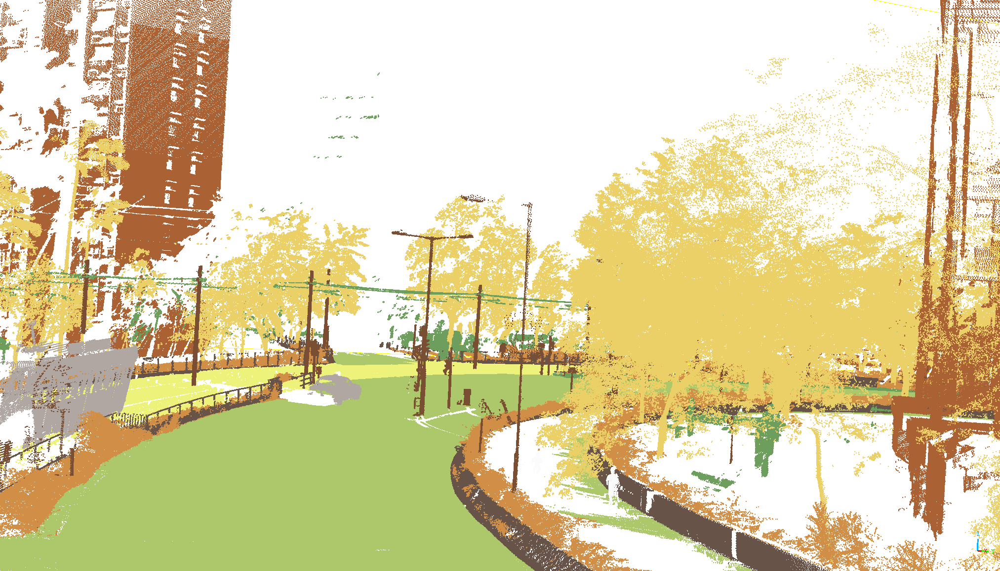

# Code for HongKong-3D datasets Semantic Segmentation

---

  
    
    &nbsp;&nbsp;&nbsp;&nbsp;&nbsp;&nbsp;&nbsp;&nbsp;&nbsp;&nbsp;&nbsp;&nbsp;
      

 points with color
&emsp;&emsp;&emsp;&emsp;&emsp;&emsp;&emsp;&emsp;&emsp;&emsp;&emsp;&emsp;&emsp;&emsp;&emsp;
&emsp;&emsp;&emsp;&emsp;&emsp;&emsp;&emsp;&emsp;&emsp;&emsp;&emsp;
labeled points

---

## Requirements

**The code is tested on the following environment**

- Python 3.9
- Pytorch 1.12.1
- laspy 2.2.2
- open3d 0.15.0
- matplotlib 3.5.1
- numpy 1.24.2
- pathlib 1.0.1
- CUDA 11.3
- cudnn 8.2.1

## Dataset

- Original dataset: HongKong-3D(.las/.laz format)
- Processed dataset: HongKong-3D(.ply format)

## Usage

### Data Preprocessing

- Using `/utils/data_prepare_hongkong.py` to preprocess the original dataset.
- Using `/utils/generate_augmented_pc.py` to generate augmented point clouds.

### Training

- Using `/main_HongKong.py` to train the model. You can try like following (more detail in the code):

>python main_HongKong.py --name NAME --log_dir LOG_DIR --max_epoch EPOCH --gpu GPU_ID --vla_split VAL_SPLIT

### Testing

- Using `/test_HongKong.py` to test the model. You can try like following (more detail in the code):

>python test_HongKong.py --checkpoint_path CHECKPOINT_PATH --name NAME --log_dir LOG_DIR

### config

- Using `/helper_tool.py` to set the parameters(including bath_size. etc).

## Results

  
      
     

